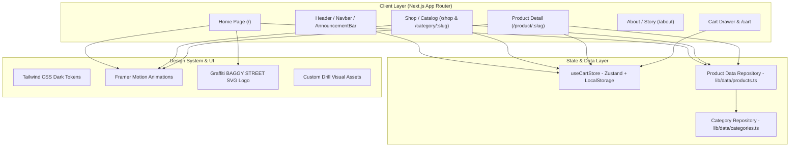

# BAGGY STREET E-Commerce Platform Implementation Plan

> **For agentic workers:** REQUIRED SUB-SKILL: Use superpowers:subagent-driven-development to implement this plan task-by-task. Steps use checkbox (`- [ ]`) syntax for tracking.

**Goal:** Build a production-grade, multi-page streetwear e-commerce web platform for "BAGGY STREET" featuring Amsterdam & Istanbul drill aesthetics, graffiti branding without star amblem, rich animations, and an interactive shopping experience.

**Architecture:** Next.js App Router full-stack web application with TypeScript and Tailwind CSS. State is managed via Zustand with `localStorage` persistence for the Cart and Wishlist. A modular data access layer provides realistic product catalogs and is structured for direct future migration to Supabase PostgreSQL.

**Architecture Diagram:**



**Tech Stack:** 
- Next.js 15 / 14 (App Router)
- React 19 / 18, TypeScript 5
- Tailwind CSS 3 / 4, clsx, tailwind-merge
- Lucide React (Icons)
- Framer Motion (Animations & Drawer transitions)
- Zustand (Cart & Wishlist State Management)
- Vitest (Unit Testing)

**Spec:** [docs/superpowers/specs/2026-09-24-baggy-street-ecommerce-design.md](file:///Users/gorhanmfatih/Desktop/new-hoodie-baggy/docs/superpowers/specs/2026-09-24-baggy-street-ecommerce-design.md)

## Global Constraints

- Platform: Web (Mobile-first responsive: 375px, 768px, 1280px, 1440px+)
- Branding: Graffiti "BAGGY STREET" typography ONLY. Absolutely NO 4-pointed star emblem.
- Localization: Turkey / Istanbul coordinates (`41.0082° N, 28.9784° E ISTANBUL`), Turkish Lira (`₺`), Turkish language UI with editorial English streetwear titles.
- Free Shipping Threshold: 2.000 TL with dynamic progress bar.
- Code Style: Strict TypeScript, modular React components under 250 lines, no placeholder images or TBDs.

---

### Task 1: Next.js Project Scaffolding & Design System Foundations

**Files:**
- Create: `package.json`
- Create: `tsconfig.json`
- Create: `tailwind.config.ts`
- Create: `postcss.config.mjs`
- Create: `src/app/globals.css`
- Create: `src/app/layout.tsx`
- Create: `src/lib/utils.ts`

**Interfaces:**
- Produces: Base Next.js app setup, `cn(...)` utility helper, dark streetwear theme tokens (colors, font hierarchy, backdrop blur, custom scrollbar).

- [ ] **Step 1: Initialize Next.js project with dependencies**

Run in terminal:
```bash
npx -y create-next-app@latest ./ --typescript --tailwind --eslint --app --src-dir --import-alias "@/*" --use-npm --skip-install
npm install lucide-react zustand clsx tailwind-merge framer-motion
npm install -D vitest @vitejs/plugin-react jsdom @testing-library/react @testing-library/jest-dom
```

- [ ] **Step 2: Configure Tailwind CSS tokens & dark theme**

Update `tailwind.config.ts`:
```typescript
import type { Config } from "tailwindcss";

const config: Config = {
  content: [
    "./src/pages/**/*.{js,ts,jsx,tsx,mdx}",
    "./src/components/**/*.{js,ts,jsx,tsx,mdx}",
    "./src/app/**/*.{js,ts,jsx,tsx,mdx}",
  ],
  theme: {
    extend: {
      colors: {
        background: "#080808",
        foreground: "#FAFAFA",
        card: "#111111",
        "card-hover": "#171717",
        muted: "#71717A",
        border: "#222222",
        accent: {
          DEFAULT: "#EF4444",
          hover: "#DC2626",
        },
      },
      fontFamily: {
        heading: ["var(--font-heading)", "system-ui", "sans-serif"],
        sans: ["var(--font-sans)", "system-ui", "sans-serif"],
      },
    },
  },
  plugins: [],
};
export default config;
```

- [ ] **Step 3: Setup global CSS with dark aesthetic & grain texture**

Update `src/app/globals.css` with clean reset, custom scrollbar, and typography styles.

- [ ] **Step 4: Verify build works cleanly**

Run: `npm run build`
Expected: Build succeeds without errors.

- [ ] **Step 5: Commit**

```bash
git add package.json tsconfig.json tailwind.config.ts postcss.config.mjs src/
git commit -m "chore: scaffold Next.js project with Tailwind and dark streetwear design tokens"
```

---

### Task 2: Data Models, Mock Database & Cart State Store

**Files:**
- Create: `src/lib/types/ecommerce.ts`
- Create: `src/lib/data/categories.ts`
- Create: `src/lib/data/products.ts`
- Create: `src/lib/store/useCartStore.ts`
- Create: `src/lib/store/__tests__/cartStore.test.ts`
- Create: `vitest.config.ts`

**Interfaces:**
- Produces: `Product`, `Category`, `CartItem` interfaces.
- Produces: `useCartStore` with `addItem(product, size, color, quantity)`, `removeItem(id, size, color)`, `updateQuantity(id, size, color, quantity)`, `clearCart()`, `subtotal()`, `freeShippingRemaining()`.

- [ ] **Step 1: Define TypeScript schemas for e-commerce entities**

In `src/lib/types/ecommerce.ts`:
```typescript
export interface Product {
  id: string;
  slug: string;
  name: string;
  price: number;
  compareAtPrice?: number;
  category: "hoodies" | "sweatpants" | "jackets" | "jeans" | "accessories";
  colors: string[];
  sizes: ("S" | "M" | "L" | "XL" | "XXL")[];
  images: string[];
  description: string;
  details: {
    material: string;
    fit: string;
    care: string;
    origin: string;
  };
  badge?: "NEW" | "HOT" | "LIMITED";
  isFeatured?: boolean;
}

export interface Category {
  id: string;
  slug: string;
  name: string;
  image: string;
  itemCount: number;
}

export interface CartItem {
  product: Product;
  size: "S" | "M" | "L" | "XL" | "XXL";
  color: string;
  quantity: number;
}
```

- [ ] **Step 2: Write unit test for Cart State & free shipping calculation**

In `src/lib/store/__tests__/cartStore.test.ts`:
```typescript
import { describe, it, expect, beforeEach } from "vitest";
import { useCartStore } from "../useCartStore";
import { Product } from "../../types/ecommerce";

const mockProduct: Product = {
  id: "drill-hoodie-1",
  slug: "drill-logo-hoodie",
  name: "Drill Logo Hoodie",
  price: 2499,
  category: "hoodies",
  colors: ["Black"],
  sizes: ["M", "L", "XL"],
  images: ["/images/products/drill-logo-hoodie.webp"],
  description: "Heavyweight drill hoodie",
  details: { material: "100% Cotton", fit: "Oversized", care: "Machine wash", origin: "Turkey" },
  badge: "NEW"
};

describe("useCartStore", () => {
  beforeEach(() => {
    useCartStore.getState().clearCart();
  });

  it("calculates subtotal and free shipping status accurately", () => {
    const store = useCartStore.getState();
    store.addItem(mockProduct, "L", "Black", 1);
    
    const state = useCartStore.getState();
    expect(state.items).toHaveLength(1);
    expect(state.getSubtotal()).toBe(2499);
    expect(state.isFreeShipping()).toBe(true);
    expect(state.getFreeShippingRemaining()).toBe(0);
  });
});
```

- [ ] **Step 3: Implement `useCartStore` with Zustand & localStorage**

In `src/lib/store/useCartStore.ts`:
Implement state, selectors, and methods. Free shipping threshold: `2000`.

- [ ] **Step 4: Seed rich products and categories matching reference JPEG**

Create `src/lib/data/products.ts` with:
- Drill Logo Hoodie (2.499 TL)
- Baggy Sweatpants (1.999 TL)
- Zip Hoodie Jacket (2.999 TL)
- Wide Leg Jeans (2.799 TL)
- Knit Cardigan (2.499 TL)
- Amsterdam Night Heavy Hoodie (2.599 TL)
- Distressed Cargo Jeans (2.899 TL)
- Drill Tactical Beanie & Chain Set (799 TL)

- [ ] **Step 5: Run tests and verify**

Run: `npx vitest run`
Expected: Tests pass.

- [ ] **Step 6: Commit**

```bash
git add src/lib/ vitest.config.ts
git commit -m "feat: implement e-commerce data models, mock database, and Zustand cart store with unit tests"
```

---

### Task 3: Brand Assets & Visual Imagery Generation

**Files:**
- Create: `src/components/layout/Logo.tsx`
- Generate: `public/images/hero/hero-bg.webp`
- Generate: `public/images/categories/hoodies-cat.webp`
- Generate: `public/images/categories/sweatpants-cat.webp`
- Generate: `public/images/categories/jackets-cat.webp`
- Generate: `public/images/categories/jeans-cat.webp`
- Generate: `public/images/categories/accessories-cat.webp`
- Generate: `public/images/products/*.webp` (5 packshots)
- Generate: `public/images/brand/brand-story.webp`
- Generate: `public/images/brand/drill-editorial-1.webp`
- Generate: `public/images/brand/drill-editorial-2.webp`

**Interfaces:**
- Produces: Authentic graffiti SVG Logo component (`<Logo className="..." />`).
- Produces: Complete set of high-resolution WebP images in `public/images/` ready for Next.js Image component.

- [ ] **Step 1: Implement custom graffiti "BAGGY STREET" SVG logo**

In `src/components/layout/Logo.tsx`:
Design an authentic, sharp graffiti streetwear wordmark in vector format. Ensure no 4-pointed star emblem is present.

- [ ] **Step 2: Generate visual imagery matching reference JPEG**

Use `generate_image` tool to produce:
1. `hero_background`: Dark cinematic night street shoot in Istanbul / Amsterdam with street lights reflecting on wet streets, models in dark baggy drill hoodies and wide pants.
2. 5 category visuals (`cat_hoodies`, `cat_sweatpants`, `cat_jackets`, `cat_jeans`, `cat_accessories`).
3. 5 product images corresponding to the catalog items.
4. 2 brand story & drill collection editorial visuals.

- [ ] **Step 3: Move/link images into `public/images/` directory structure**

- [ ] **Step 4: Verify image availability**

Verify files exist in `public/images/` and display properly.

- [ ] **Step 5: Commit**

```bash
git add src/components/layout/Logo.tsx public/images/
git commit -m "feat: add graffiti BAGGY STREET logo component and high-resolution streetwear imagery"
```

---

### Task 4: Global Layout Shell (AnnouncementBar, Navbar, MobileMenu, Footer)

**Files:**
- Create: `src/components/layout/AnnouncementBar.tsx`
- Create: `src/components/layout/Navbar.tsx`
- Create: `src/components/layout/MobileMenu.tsx`
- Create: `src/components/layout/Footer.tsx`
- Modify: `src/app/layout.tsx`

**Interfaces:**
- Consumes: `useCartStore` (item count for badge, openCartDrawer action), `Logo.tsx`.
- Produces: Responsive site-wide navigation, slide-out mobile drawer, announcement ticker, and dark footer with Istanbul details.

- [ ] **Step 1: Implement `AnnouncementBar`**

In `src/components/layout/AnnouncementBar.tsx`:
Continuous smooth ticker or marquee displaying:
*"2.000 TL ÜZERİ TÜM TÜRKİYE'YE ÜCRETSİZ KARGO — YENİ DROP: ISTANBUL DRILL 2026 — SOKAK MODASINI YENİDEN TANIMLA"*

- [ ] **Step 2: Implement `Navbar` & `MobileMenu`**

In `src/components/layout/Navbar.tsx`:
- Desktop navigation links: `SHOP`, `COLLECTIONS`, `ABOUT`.
- Center: `<Logo />`.
- Right: Search toggle, Wishlist icon, Cart trigger button with animated item count badge from `useCartStore`.
- Mobile hamburger menu triggering `<MobileMenu />`.
- Backdrop blur and dark subtle border on scroll.

- [ ] **Step 3: Implement `Footer`**

In `src/components/layout/Footer.tsx`:
- Logo and tagline.
- Links: Shop, Collections, About, Contact.
- Newsletter subscription form with client-side email format validation and success state.
- Istanbul coordinates: `41.0082° N, 28.9784° E ISTANBUL / TURKEY`.
- Social media icons (Instagram, TikTok, YouTube, Spotify).
- Back-to-top scroll trigger button.

- [ ] **Step 4: Integrate Shell into `src/app/layout.tsx`**

Embed `AnnouncementBar`, `Navbar`, and `Footer` in `RootLayout`.

- [ ] **Step 5: Verify build & visual check**

Run: `npm run build`
Expected: Succeeds without errors.

- [ ] **Step 6: Commit**

```bash
git add src/components/layout/ src/app/layout.tsx
git commit -m "feat: implement global layout shell with Navbar, AnnouncementBar, MobileMenu, and Footer"
```

---

### Task 5: Slide-out Cart Drawer & Dedicated Cart Page (`/cart`)

**Files:**
- Create: `src/components/cart/CartDrawer.tsx`
- Create: `src/components/cart/CartItemRow.tsx`
- Create: `src/components/cart/FreeShippingBar.tsx`
- Create: `src/app/cart/page.tsx`
- Modify: `src/app/layout.tsx` (mount `CartDrawer` globally)

**Interfaces:**
- Consumes: `useCartStore`.
- Produces: Slide-over drawer opening anywhere in the app, item quantity adjustments, free shipping progress bar, promo code input, checkout button, and standalone `/cart` view.

- [ ] **Step 1: Implement `FreeShippingBar`**

In `src/components/cart/FreeShippingBar.tsx`:
- Progress bar filling up to 2.000 TL.
- Dynamic message: *"Ücretsiz kargo için {remaining} TL daha ekleyin"* or *"🎉 Tebrikler! Kargonuz Ücretsiz!"*.

- [ ] **Step 2: Implement `CartItemRow`**

In `src/components/cart/CartItemRow.tsx`:
- Product image thumbnail, title, selected size pill, color dot, price in TL.
- Quantity counter buttons (`-`, count, `+`).
- Trash icon to remove item.

- [ ] **Step 3: Implement `CartDrawer` with Framer Motion**

In `src/components/cart/CartDrawer.tsx`:
- AnimatePresence backdrop blur + right slide-in drawer.
- Header with title "SEPETİNİZ" and item count.
- List of items or stylish empty state ("Sepetiniz boş — Sokak tarzını keşfet").
- Summary section: Subtotal, Shipping fee, Total.
- Promo code input field (e.g. `BAGGY10` for 10% discount).
- "SİPARİŞİ TAMAMLA" primary CTA button.

- [ ] **Step 4: Implement `/cart` standalone page**

In `src/app/cart/page.tsx`:
- Full-page table/grid view of cart contents with breadcrumbs, order summary sidebar, and security guarantee badges.

- [ ] **Step 5: Mount `CartDrawer` into `src/app/layout.tsx` & test**

Verify adding an item opens drawer and recalculates accurately.

- [ ] **Step 6: Commit**

```bash
git add src/components/cart/ src/app/cart/ src/app/layout.tsx
git commit -m "feat: implement slide-out CartDrawer, FreeShippingBar, and full cart page"
```

---

### Task 6: Homepage (`/`) — Exact Reference Match

**Files:**
- Create: `src/components/home/HeroSection.tsx`
- Create: `src/components/home/CategoryGrid.tsx`
- Create: `src/components/home/BrandStory.tsx`
- Create: `src/components/home/LatestDropsCarousel.tsx`
- Create: `src/components/home/DrillEditorial.tsx`
- Modify: `src/app/page.tsx`

**Interfaces:**
- Consumes: Products & Categories from `src/lib/data/`, `Logo.tsx`, `useCartStore`.
- Produces: Pixel-accurate homepage matching `home-page-referance.jpeg` with Istanbul coordinates and graffiti branding.

- [ ] **Step 1: Implement `HeroSection`**

In `src/components/home/HeroSection.tsx`:
- Full-screen or large viewport hero with atmospheric dark street photography.
- Top overlays: `41.0082° N, 28.9784° E ISTANBUL`, *"STREETWEAR REDEFINED"*, *"Same City Different Mindset"*.
- Center: Graffiti "BAGGY STREET" logo, category quick links (`HOODIES / SWEATPANTS / JACKETS / JEANS / MORE`).
- Primary CTA: *"SHOP NOW →"* leading to `/shop`.

- [ ] **Step 2: Implement `CategoryGrid`**

In `src/components/home/CategoryGrid.tsx`:
- 5 columns on desktop, responsive 2 columns on mobile.
- Cards: HOODIES, SWEATPANTS, JACKETS, JEANS, ACCESSORIES.
- Dark overlay, zoom on hover, title + "SHOP NOW →" links directing to `/shop?category={slug}`.

- [ ] **Step 3: Implement `BrandStory` ("FROM ISTANBUL TO THE WORLD")**

In `src/components/home/BrandStory.tsx`:
- Two-column editorial section:
  - Left: "BAGGY STREET", "FROM ISTANBUL TO THE WORLD", manifesto paragraph in Turkish: *"Baggy Street, İstanbul sokaklarının dinamik enerjisinden ve Amsterdam drill kültüründen ilham alan, modern sokak stilini özgün kalıplarla bir araya getirir. Ağır gramajlı kumaşlar, oversize kesimler ve güçlü detaylarla tarzını sokaklarda ifade et."*, *"OUR STORY →"* button linking to `/about`.
  - Right: Editorial model imagery in dark street lighting.

- [ ] **Step 4: Implement `LatestDropsCarousel`**

In `src/components/home/LatestDropsCarousel.tsx`:
- Header: "NEW ARRIVALS / LATEST DROPS" with "TÜM ÜRÜNLER →" link.
- 5 product cards with "NEW" badge, product title, formatted price in TL, quick size selection or instant "Sepete Ekle" button.
- Horizontal scroll with navigation buttons.

- [ ] **Step 5: Implement `DrillEditorial`**

In `src/components/home/DrillEditorial.tsx`:
- Left banner: "THE DRILL COLLECTION — MORE THAN CLOTHES IT'S A LIFESTYLE. EXPLORE →".
- Right grid: Lifestyle tunnel and night shoot photos, plus "ISTANBUL COLLECTION — SHOP NOW →".

- [ ] **Step 6: Assemble into `src/app/page.tsx` & verify**

Run `npm run build` to ensure clean compilation.

- [ ] **Step 7: Commit**

```bash
git add src/components/home/ src/app/page.tsx
git commit -m "feat: assemble homepage with Hero, CategoryGrid, BrandStory, LatestDrops, and DrillEditorial"
```

---

### Task 7: Shop / Catalog Page (`/shop` & `/category/[slug]`)

**Files:**
- Create: `src/components/shop/FilterBar.tsx`
- Create: `src/components/shop/SortDropdown.tsx`
- Create: `src/components/products/ProductCard.tsx`
- Create: `src/app/shop/page.tsx`
- Create: `src/app/category/[slug]/page.tsx`

**Interfaces:**
- Consumes: Products from `src/lib/data/products.ts`, categories from `src/lib/data/categories.ts`, `useCartStore`.
- Produces: Dynamic multi-page catalog with URL parameter sync, category tabs, filter drawer for mobile, sort options, and responsive product grid.

- [ ] **Step 1: Implement `ProductCard`**

In `src/components/products/ProductCard.tsx`:
- Product image with subtle zoom hover.
- "NEW" badge if applicable.
- Name, price formatted in TL (`2.499 TL`).
- Color indicator dots.
- Quick size select popover or button to add directly to cart.
- Link leading to `/product/[slug]`.

- [ ] **Step 2: Implement `FilterBar` & `SortDropdown`**

In `src/components/shop/FilterBar.tsx`:
- Category tabs: Tümü, Hoodies, Sweatpants, Jackets, Jeans, Aksesuarlar.
- Size filter pills (S, M, L, XL, XXL).
- Color selector dots (Siyah, Gri, Denim).
- URL sync via `useSearchParams` and `useRouter` (e.g. `/shop?category=hoodies&size=L`).

- [ ] **Step 3: Implement `/shop/page.tsx`**

- Grid of filtered products.
- Active filters count, "Filtreleri Temizle" reset button.
- Empty state if no products match selected criteria.

- [ ] **Step 4: Implement `/category/[slug]/page.tsx`**

- Dedicated category view with SEO title, hero banner for that category, and pre-filtered product listing.

- [ ] **Step 5: Verify build & filter interaction**

Run `npm run build`.

- [ ] **Step 6: Commit**

```bash
git add src/components/shop/ src/components/products/ProductCard.tsx src/app/shop/ src/app/category/
git commit -m "feat: implement multi-page catalog with URL-synced filtering and product grid"
```

---

### Task 8: Interactive Product Detail Page (`/product/[slug]`)

**Files:**
- Create: `src/components/products/ProductGallery.tsx`
- Create: `src/components/products/SizeSelector.tsx`
- Create: `src/components/products/SizeGuideModal.tsx`
- Create: `src/components/products/ProductAccordion.tsx`
- Create: `src/components/products/RelatedProducts.tsx`
- Create: `src/app/product/[slug]/page.tsx`

**Interfaces:**
- Consumes: `Product` data by slug, `useCartStore.addItem`.
- Produces: Rich PDP with interactive gallery, size/color selectors, size guide modal, accordion specs, and related drops.

- [ ] **Step 1: Implement `ProductGallery`**

In `src/components/products/ProductGallery.tsx`:
- Left column with vertical thumbnails.
- Main large view with active image preview and zoom hover.

- [ ] **Step 2: Implement `SizeSelector` & `SizeGuideModal`**

In `src/components/products/SizeSelector.tsx`:
- Pill buttons for sizes (S, M, L, XL, XXL).
- Out of stock indicator if size unavailable.
- Link: "📏 Beden Tablosu (Size Guide)".
- In `SizeGuideModal.tsx`: Modal showing chest, shoulder, length measurements in cm for Boxy/Oversized cuts.

- [ ] **Step 3: Implement `ProductAccordion`**

In `src/components/products/ProductAccordion.tsx`:
- Kumaş & Materyal (%100 Ağır French Terry Pamuk, 460 GSM).
- Kalıp ve Beden Bilgisi (Model 185cm / 80kg - L Beden Giyiyor).
- Yıkama ve Bakım (30°C Ters Çevirerek Yıkayınız).
- Teslimat & İade (Yurtiçi Kargo ile 2-4 İş Gününde Kapında, 14 Gün Koşulsuz İade).

- [ ] **Step 4: Implement `RelatedProducts`**

In `src/components/products/RelatedProducts.tsx`:
- Curated recommendations based on category.

- [ ] **Step 5: Assemble `/product/[slug]/page.tsx`**

- Sticky right details column with title, price, size selector, quantity, and primary "SEPETE EKLE" button.
- Clicking "SEPETE EKLE" adds item to `useCartStore` with selected size and color, and opens `CartDrawer`.

- [ ] **Step 6: Verify build & PDP interactivity**

Run `npm run build`.

- [ ] **Step 7: Commit**

```bash
git add src/components/products/ src/app/product/
git commit -m "feat: implement interactive product detail page with size guide, gallery, and accordions"
```

---

### Task 9: Brand Story Page (`/about`) & Refinements

**Files:**
- Create: `src/app/about/page.tsx`
- Create: `src/components/about/BrandManifesto.tsx`
- Create: `src/components/about/LookbookGrid.tsx`

**Interfaces:**
- Produces: Dedicated `/about` route showcasing Istanbul & Amsterdam street culture fusion, lookbook images, and brand ethos.

- [ ] **Step 1: Implement `BrandManifesto` & `LookbookGrid`**

In `src/components/about/`:
- Editorial story section with bold typography and dark cinematic photography.
- Pillars: Heavyweight Fabrics, Raw Oversized Cuts, Underground Street & Drill Culture.

- [ ] **Step 2: Assemble `/about/page.tsx`**

- [ ] **Step 3: Commit**

```bash
git add src/components/about/ src/app/about/
git commit -m "feat: implement editorial brand story and lookbook page"
```

---

### Task 10: End-to-End Verification, Performance & Visual Audit

**Files:**
- Test scripts or browser validation
- Modify: minor bug fixes across files if discovered

- [ ] **Step 1: Run production build and linting**

Run:
```bash
npm run build
npm run lint
```
Expected: 0 errors, all routes statically/dynamically generated.

- [ ] **Step 2: Run unit tests**

Run:
```bash
npx vitest run
```
Expected: All tests pass.

- [ ] **Step 3: Test multi-page navigation and cart drawer flow in browser**

Verify:
- Homepage (`/`) loads with graffiti logo, hero, categories, carousel, brand story, drill editorial, footer.
- Catalog (`/shop`) filters properly by category and size.
- Product page (`/product/drill-logo-hoodie`) loads gallery, size selector, and size guide modal.
- Clicking "SEPETE EKLE" opens CartDrawer with item, updates count badge, and recalculates free shipping threshold.
- About page (`/about`) renders editorial lookbook.
- Mobile viewport (375px) renders touch-friendly layout with functional mobile menu.

- [ ] **Step 4: Final commit**

```bash
git add .
git commit -m "feat: complete Baggy Street multi-page e-commerce platform implementation"
```
