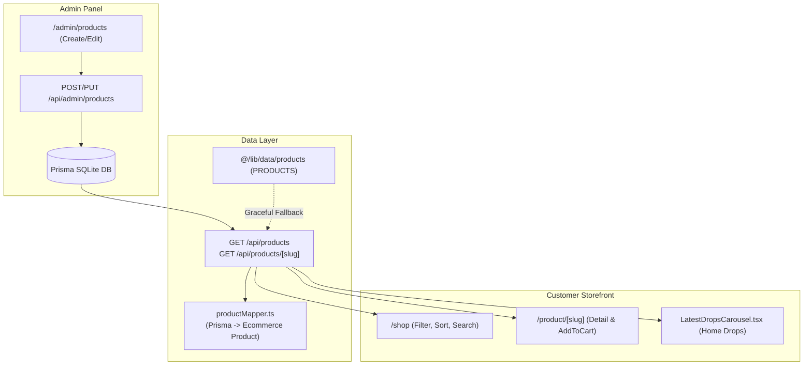

# Dynamic Storefront Products Synchronization Implementation Plan

> **For agentic workers:** REQUIRED SUB-SKILL: Use superpowers:subagent-driven-development to implement this plan task-by-task. Steps use checkbox (`- [ ]`) syntax for tracking.

**Goal:** Connect the customer storefront (`/shop`, `/product/[slug]`, and homepage `LatestDropsCarousel`) directly to the Prisma database so that products created or updated in the Admin Panel appear instantly in the store, while preserving zero-flash instant loads through graceful static fallback.

**Architecture:** Create a public API layer (`/api/products` and `/api/products/[slug]`) backed by Prisma SQLite. A dedicated product mapper converts Prisma model relations (`Product`, `ProductDetails`, `ProductSizeStock`) into the storefront's `Product` interface. The storefront pages initialize with static `PRODUCTS` for immediate SSR/hydration, then fetch `/api/products` to merge newly created admin products.

**Architecture Diagram:**



**Tech Stack:** Next.js 16 (App Router), React 19, Prisma ORM 6.19, TypeScript 5, Vitest 4, Zustand.

**Spec:** `docs/superpowers/specs/2026-09-24-baggy-street-ecommerce-design.md`

## Global Constraints

- Never break storefront rendering: If the database is empty or queries fail, gracefully fallback to `@/lib/data/products`.
- No "havlu" or "French Terry" mentions in newly generated copy or fallbacks; use "460 GSM Ağır Gramaj Saf Pamuk".
- Full TypeScript typing and zero `@typescript-eslint/no-explicit-any` errors.
- All unit and integration tests must pass (`npm test`).
- Production build must succeed with 0 errors (`npm run build`).

---

### Task 1: Product Mapper & Type Utilities

**Files:**
- Create: `src/lib/productMapper.ts`
- Test: `src/lib/__tests__/productMapper.test.ts`

**Interfaces:**
- Consumes: Prisma `Product` with `details: ProductDetails | null` and `sizes: ProductSizeStock[]`
- Produces: `mapPrismaProductToEcommerce(p: PrismaProductWithRelations): Product`

- [ ] **Step 1: Write the failing unit test**

Create `src/lib/__tests__/productMapper.test.ts`:
```typescript
import { describe, it, expect } from 'vitest';
import { mapPrismaProductToEcommerce } from '../productMapper';

describe('productMapper', () => {
  it('correctly maps a Prisma product with relations to storefront Product', () => {
    const prismaProduct = {
      id: 'prod-test-1',
      slug: 'heavy-test-hoodie',
      name: 'Heavy Test Hoodie',
      category: 'hoodies',
      price: 2450,
      comparePrice: 2850,
      badge: 'NEW',
      image: '/images/products/test.webp',
      gallery: JSON.stringify(['/images/products/test-1.webp', '/images/products/test-2.webp']),
      description: 'Ağır gramajlı sokak kapüşonlusu.',
      inStock: true,
      createdAt: new Date(),
      updatedAt: new Date(),
      details: {
        id: 'det-1',
        productId: 'prod-test-1',
        fabric: '%100 Ağır Gramaj Saf Pamuk (460 GSM)',
        fit: 'Boxy Oversize',
        gsm: 460,
        origin: 'İstanbul, Türkiye',
        care: JSON.stringify(["30°C'de yıkayınız"]),
      },
      sizes: [
        { id: 's-1', productId: 'prod-test-1', size: 'M', stock: 15 },
        { id: 's-2', productId: 'prod-test-1', size: 'L', stock: 20 },
        { id: 's-3', productId: 'prod-test-1', size: 'XL', stock: 0 },
      ],
    };

    const mapped = mapPrismaProductToEcommerce(prismaProduct);

    expect(mapped.id).toBe('prod-test-1');
    expect(mapped.slug).toBe('heavy-test-hoodie');
    expect(mapped.price).toBe(2450);
    expect(mapped.compareAtPrice).toBe(2850);
    expect(mapped.category).toBe('hoodies');
    expect(mapped.images).toContain('/images/products/test-1.webp');
    expect(mapped.sizes).toEqual(['M', 'L', 'XL']);
    expect(mapped.details.material).toContain('460 GSM');
  });
});
```

- [ ] **Step 2: Run test to verify it fails**

Run: `npx vitest run src/lib/__tests__/productMapper.test.ts`
Expected: FAIL with "Cannot find module '../productMapper'"

- [ ] **Step 3: Implement `src/lib/productMapper.ts`**

```typescript
import { Product, ProductSize, CategorySlug } from './types/ecommerce';
import { Prisma } from '@prisma/client';

export type PrismaProductWithRelations = Prisma.ProductGetPayload<{
  include: { details: true; sizes: true };
}>;

const CATEGORY_NAMES: Record<string, string> = {
  hoodies: 'HOODIES',
  sweatpants: 'SWEATPANTS',
  jackets: 'JACKETS',
  jeans: 'JEANS',
  accessories: 'ACCESSORIES',
  shirts: 'SHIRTS',
  tshirts: 'T-SHIRTS',
};

export function mapPrismaProductToEcommerce(p: PrismaProductWithRelations): Product {
  // Parse gallery images
  let images: string[] = [];
  if (p.gallery) {
    try {
      const parsed = JSON.parse(p.gallery);
      if (Array.isArray(parsed)) {
        images = parsed.filter((item): item is string => typeof item === 'string' && item.length > 0);
      }
    } catch {
      images = [p.image];
    }
  }
  if (!images.includes(p.image)) {
    images.unshift(p.image);
  }
  if (images.length === 0) {
    images = ['/images/products/drill-logo-hoodie.webp'];
  }

  // Parse sizes (ordered S, M, L, XL, XXL)
  const sizeOrder: ProductSize[] = ['S', 'M', 'L', 'XL', 'XXL'];
  const sizes: ProductSize[] = p.sizes
    ? p.sizes
        .map((s) => s.size as ProductSize)
        .sort((a, b) => sizeOrder.indexOf(a) - sizeOrder.indexOf(b))
    : ['S', 'M', 'L', 'XL'];

  // Parse care instructions
  let careString = "30°C'de ters çevirerek yıkayınız. Ağartıcı ve kurutma makinesi kullanmayınız.";
  if (p.details?.care) {
    try {
      const parsedCare = JSON.parse(p.details.care);
      if (Array.isArray(parsedCare)) {
        careString = parsedCare.join('. ');
      } else if (typeof parsedCare === 'string') {
        careString = parsedCare;
      }
    } catch {
      careString = p.details.care;
    }
  }

  const categorySlug = (p.category.toLowerCase()) as CategorySlug;
  const categoryName = CATEGORY_NAMES[categorySlug] || p.category.toUpperCase();

  return {
    id: p.id,
    slug: p.slug,
    name: p.name,
    price: p.price,
    compareAtPrice: p.comparePrice ?? undefined,
    category: categorySlug,
    categoryName,
    colors: ['Siyah'],
    sizes: sizes.length > 0 ? sizes : ['S', 'M', 'L', 'XL'],
    images,
    description: p.description,
    shortDescription: p.description.slice(0, 110) + (p.description.length > 110 ? '...' : ''),
    details: {
      material: p.details?.fabric || '%100 Ağır Gramaj Saf Pamuk',
      fit: p.details?.fit || 'Boxy / Heavy Oversize',
      care: careString,
      origin: p.details?.origin || 'İstanbul, Türkiye',
    },
    badge: (p.badge as 'NEW' | 'HOT' | 'LIMITED') || undefined,
    isFeatured: p.badge === 'HOT' || p.badge === 'NEW' || true,
  };
}
```

- [ ] **Step 4: Run test to verify it passes**

Run: `npx vitest run src/lib/__tests__/productMapper.test.ts`
Expected: PASS

- [ ] **Step 5: Commit**

```bash
git add src/lib/productMapper.ts src/lib/__tests__/productMapper.test.ts
git commit -m "feat(products): create productMapper for Prisma to storefront Product conversion"
```

---

### Task 2: Public Products API Routes

**Files:**
- Create: `src/app/api/products/route.ts`
- Create: `src/app/api/products/[slug]/route.ts`
- Test: `src/app/api/products/__tests__/products.test.ts`

**Interfaces:**
- `GET /api/products?category=...&featured=...&search=...&sort=...` -> `{ success: true, count: number, products: Product[] }`
- `GET /api/products/[slug]` -> `{ success: true, product: Product }` (or 404)

- [ ] **Step 1: Write integration tests in `src/app/api/products/__tests__/products.test.ts`**
- [ ] **Step 2: Implement `src/app/api/products/route.ts`**
- [ ] **Step 3: Implement `src/app/api/products/[slug]/route.ts`**
- [ ] **Step 4: Run integration tests**
- [ ] **Step 5: Commit**

---

### Task 3: Storefront Shop Page Dynamic Sync

**Files:**
- Modify: `src/app/shop/page.tsx`

**Behavior:**
- Initialize `products` state with `PRODUCTS` (no blank loading screen).
- On mount, asynchronously fetch `/api/products` and update state with DB products (including newly added admin products).
- Filter and sorting continues to function seamlessly with dynamic counts.

- [ ] **Step 1: Update `src/app/shop/page.tsx` with dynamic fetching**
- [ ] **Step 2: Verify in browser or curl that `/shop` renders with merged products**
- [ ] **Step 3: Commit changes**

---

### Task 4: Storefront Product Detail Page Dynamic Support

**Files:**
- Modify: `src/app/product/[slug]/page.tsx`

**Behavior:**
- If product is found in `PRODUCTS`, load immediately with static data.
- If product is NOT in static `PRODUCTS` (e.g. newly created in Admin Panel), fetch from `/api/products/${slug}` and display full product details, size picker, and Add-to-Cart.
- If not found in DB either, trigger `notFound()`.

- [ ] **Step 1: Update `src/app/product/[slug]/page.tsx`**
- [ ] **Step 2: Verify that custom admin product slug loads correctly**
- [ ] **Step 3: Commit changes**

---

### Task 5: Homepage Latest Drops Carousel Dynamic Sync

**Files:**
- Modify: `src/components/home/LatestDropsCarousel.tsx`

**Behavior:**
- Initial render uses `PRODUCTS` for zero SSR delay.
- In `useEffect`, fetch `/api/products?featured=true` and update state so any new drops created in the Admin Panel appear in the homepage slider.

- [ ] **Step 1: Update `LatestDropsCarousel.tsx`**
- [ ] **Step 2: Verify homepage carousel renders all products including new ones**
- [ ] **Step 3: Commit changes**

---

### Task 6: End-to-End Verification & Build Test

- [ ] **Step 1: Run full test suite (`npm test`)**
- [ ] **Step 2: Run linter (`npm run lint`)**
- [ ] **Step 3: Run production build (`npm run build`)**
- [ ] **Step 4: Push to `main` branch**
